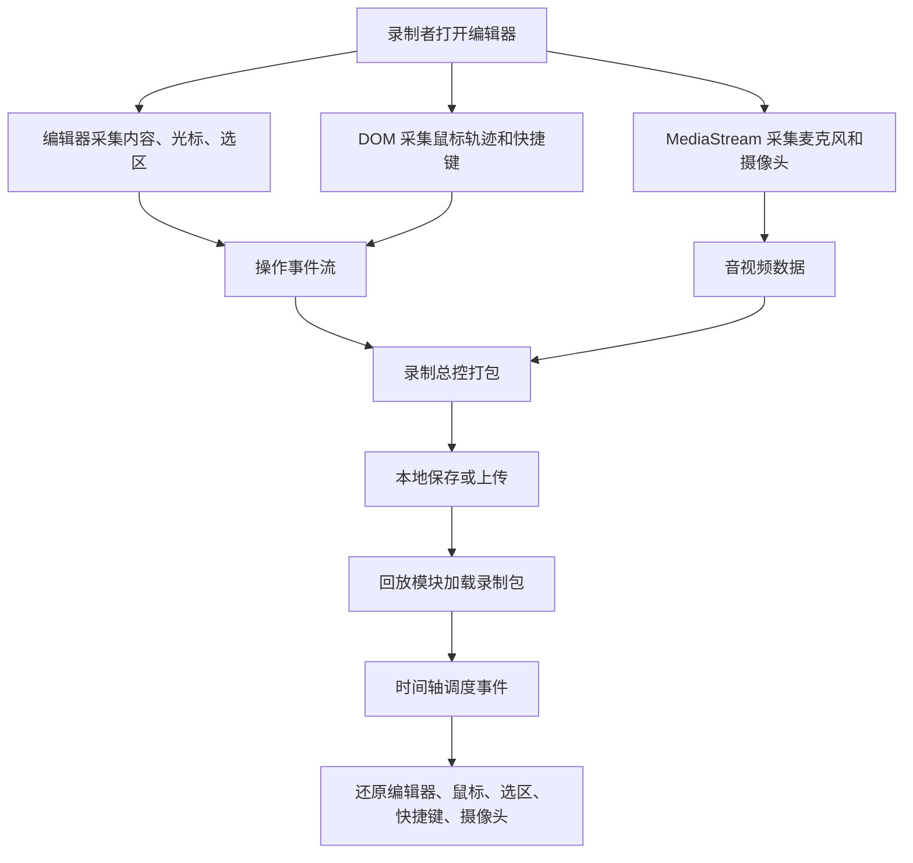

# 代码讲解工具技术模块拆解

> **阅读摘要**
>
> 当前产品的技术主线是：在 Web 端集成代码编辑器，录制讲解者的编辑器操作事件、鼠标轨迹、快捷键、麦克风和摄像头数据，再通过时间轴回放引擎还原讲解过程。P0 应优先完成「编辑器集成、操作录制、音视频录制、录制总控、回放」五个主流程模块；P1 再补齐 UI 体验、云端回放中心和代码执行安全增强；P1+ 可扩展 WebRTC 实时面试和本地 AI 字幕。

## 一、模块总览

| 技术模块 | 优先级 | 核心目标 | 关键产物 |
| --- | --- | --- | --- |
| 代码编辑器模块 | P0 | 提供可录制、可运行、可配置的代码编辑环境 | 编辑器组件、工具栏、代码运行入口 |
| 操作录制模块 | P0 | 将编辑行为转成带时间戳的事件流 | 操作事件模型、事件采集器、事件存储结构 |
| 音视频录制模块 | P0 | 同步采集讲解音频与摄像头画面 | MediaStream 管理、录制数据、摄像头预览 |
| 录制总控模块 | P0 | 管理录制生命周期并打包录制结果 | 录制状态机、计时器、录制包 |
| 回放模块 | P0 | 按时间轴还原讲解过程 | 回放调度器、播放器控制条、同步展示层 |
| 代码执行/展示沙箱 | P0/P1 | 支持运行代码并展示结果，避免污染宿主环境 | 后端执行接口或前端沙箱 iframe |
| UI 与交互模块 | P1 | 提升产品可用性和演示效果 | 主题切换、PC 布局、回放展示开关 |
| 云端回放中心 | P1 | 保存和管理录制内容 | 录制上传、列表页、播放/删除/重命名 |
| WebRTC 实时面试模块 | P1+ | 支持远程实时协作和面试场景 | 实时事件同步、双向音视频通话 |
| AI 字幕模块 | P1+ | 从音频生成可交互字幕和章节 | 时间戳字幕、字幕 seek、纠错与分段 |

## 二、P0 主流程技术模块

### 1. 代码编辑器模块

代码编辑器是录制和回放的基础载体，技术重点不只是展示代码，而是要稳定暴露内容、光标、选区和快捷键等状态。

需要实现的技术点：

- 嵌入 Web 代码编辑器组件。
- 支持 JavaScript / TypeScript 语法高亮。
- 支持基础补全能力。
- 支持常见编辑器快捷键，例如格式化、注释、跳转。
- 提供编辑器工具栏，包括语言切换、字号等基础设置。
- 监听每次内容变更，供操作录制模块生成内容变更事件。
- 读取光标位置和文本选区，供操作录制与回放同步使用。
- 支持提交代码运行，并展示 `stdout` / `stderr`，或在前端直接展示运行结果。

可选型方向：

- Monaco Editor：能力完整，接近 VS Code 体验，适合 JS/TS 教学场景。
- CodeMirror：体积相对轻，扩展灵活，适合更轻量的编辑体验。

### 2. 操作录制模块

操作录制模块是产品核心。PRD 明确要求录制结果不是视频，而是一系列带时间戳的事件流，因此该模块需要先定义事件模型，再接入编辑器和 DOM 事件采集。

需要实现的技术点：

- 设计统一事件结构，例如 `type`、`timestamp`、`payload`。
- 记录内容变更事件：每次编辑器内容变化后，保存变更后的完整代码内容。
- 记录光标与选区事件：保存光标位置、选区起止位置。
- 记录鼠标轨迹事件：保存鼠标在编辑器区域内的坐标。
- 对鼠标轨迹做采样降频，减少录制体积。
- 记录快捷键事件：单独捕获不直接产生字符的控制类组合键，例如 `Ctrl+Z`、`Ctrl+/`。
- 保证事件按录制时间排序。
- 为暂停、继续录制处理时间偏移，避免回放时间轴错位。

建议的事件类型：

| 事件类型 | 说明 | 典型 payload |
| --- | --- | --- |
| `content-change` | 编辑器内容变化 | `code`、`language` |
| `selection-change` | 光标或选区变化 | `cursor`、`selection` |
| `mouse-move` | 鼠标轨迹 | `x`、`y` |
| `shortcut` | 快捷键触发 | `keys`、`label` |
| `record-marker` | 录制状态标记 | `action` |

### 3. 音视频录制模块

音视频录制模块负责采集讲解者声音和摄像头画面，并与操作事件使用同一条录制时间轴对齐。

需要实现的技术点：

- 使用 `MediaDevices.getUserMedia` 获取麦克风音频流。
- 使用 `MediaDevices.getUserMedia` 获取摄像头视频流。
- 管理 `MediaStreamTrack` 的开启、关闭和释放。
- 支持麦克风开关。
- 支持摄像头开关。
- 支持录制设备枚举与切换。
- 使用 `MediaRecorder` 录制音视频数据。
- 提供摄像头悬浮预览窗口。
- 支持摄像头预览窗口拖拽和位置保存。
- 处理浏览器权限拒绝、设备不存在、设备切换失败等异常状态。

### 4. 录制总控模块

录制总控模块负责协调编辑器事件、鼠标事件、快捷键事件和音视频录制，是整个录制流程的状态中心。

需要实现的技术点：

- 录制状态机：`idle`、`recording`、`paused`、`stopped`。
- 开始录制：初始化时间轴、事件采集器和音视频录制器。
- 暂停录制：暂停事件采集和音视频录制，记录暂停点。
- 继续录制：恢复采集并修正时间偏移。
- 结束录制：停止采集、释放设备、生成录制结果。
- 实时显示录制时长。
- 将操作事件序列和音视频数据统一打包。
- 提供本地保存或上传入口。

录制包建议包含：

```json
{
  "meta": {
    "title": "示例讲解",
    "duration": 120000,
    "createdAt": "2026-05-22T00:00:00.000Z",
    "language": "typescript"
  },
  "events": [],
  "media": {
    "audioVideoBlob": "Blob 或远端地址",
    "mimeType": "video/webm"
  }
}
```

### 5. 回放模块

回放模块需要按照时间轴调度事件，动态还原编辑器、鼠标、快捷键、光标选区和摄像头视频。

需要实现的技术点：

- 回放时间轴调度器。
- 基于事件序列还原编辑器内容。
- 根据进度恢复指定时间点前的最近状态。
- 支持播放、暂停、继续。
- 支持倍速播放：`0.5x`、`1x`、`1.5x`、`2x`。
- 支持拖动进度条 seek 到任意位置。
- 支持音量调节和静音。
- 同步播放摄像头视频。
- 展示鼠标位置，使用类似激光笔的视觉效果。
- 展示光标与选区。
- 展示快捷键浮层，并在短暂停留后淡出。
- 处理 seek 后快捷键浮层、鼠标位置和选区状态的恢复。

回放引擎的关键难点：

- 倍速下事件调度不能漂移。
- seek 时不能从头逐帧播放，应支持快速计算目标时间点状态。
- 音视频进度和事件流进度需要对齐。
- 暂停、继续、拖拽进度条时，编辑器状态必须保持一致。

## 三、P1 增强体验与扩展模块

### 1. UI 与交互模块

需要实现的技术点：

- 支持深色 / 浅色主题切换。
- 适配 PC 端布局。
- 将录制操作区、编辑器区、运行结果区和回放区清晰分区。
- 回放时支持手动开关快捷键展示。
- 为录制中、暂停中、保存中、上传中、回放中等状态提供清晰反馈。

### 2. 云端回放中心

需要实现的技术点：

- 录制完成后上传录制包。
- 后端保存录制记录和媒体文件。
- 列表展示所有录制，字段包括标题、时长、录制时间。
- 支持在线播放录制内容。
- 支持删除录制。
- 支持重命名录制标题。
- 处理上传进度、上传失败、重复提交等状态。

建议后端数据模型：

| 字段 | 说明 |
| --- | --- |
| `id` | 录制唯一标识 |
| `title` | 录制标题 |
| `duration` | 录制时长 |
| `createdAt` | 录制时间 |
| `eventUrl` | 事件序列存储地址 |
| `mediaUrl` | 音视频文件地址 |
| `mimeType` | 媒体类型 |

### 3. 代码执行/展示沙箱

PRD 对沙箱执行给出了二选一方向：后端代码沙箱执行，或前端代码页面展示。当前需要先做技术路线确认。

#### 方案 A：后端代码执行

基础技术点：

- 前端提交 JS/TS 代码到后端。
- 后端执行代码并返回 `stdout` / `stderr`。
- 前端展示运行结果。

安全增强技术点：

- 执行超时限制，防止死循环。
- 内存限制，防止资源耗尽。
- 进程级隔离或容器级隔离。
- 调研 V8 Isolate、QuickJS WASM、Docker 容器等方案。

#### 方案 B：前端代码展示

基础技术点：

- 前端接收 JS/TS/CSS/HTML 代码。
- 在隔离区域展示运行效果。
- 避免运行代码污染主应用逻辑。

安全增强技术点：

- 使用 iframe 沙箱隔离运行环境。
- 拦截 `console` 输出，并在界面中展示。
- 限制弹窗等影响宿主页面的 API。
- 控制脚本执行边界和错误展示。

## 四、P1+ 进阶模块

### 1. WebRTC 实时面试模块

需要实现的技术点：

- 区分被面试者端和面试官端角色。
- 被面试者端正常采集编辑器操作事件。
- 将操作事件实时推送到面试官端。
- 面试官端实时还原被面试者编辑器状态。
- 使用 WebRTC 建立双向音视频通话。
- 面试结束后保存本次录制为可回放内容。
- 处理网络抖动、乱序、延迟导致的事件时序同步问题。

### 2. AI 字幕模块

需要实现的技术点：

- 从录制音频中提取可识别音轨。
- 接入语音识别模型生成文字。
- 生成带时间戳的字幕文件。
- 回放时在编辑器下方展示字幕。
- 字幕随播放进度滚动。
- 支持点击字幕跳转到对应时间点。
- 调研 Whisper.cpp 或 WASM 版本。
- 接入本地 LLM 对专业术语、变量名等识别结果进行纠错。
- 基于字幕内容自动分段，生成章节跳转点。

## 五、核心技术链路



## 六、建议实施顺序

1. 先完成编辑器模块选型与基础集成。
2. 定义操作事件模型，打通内容变更、光标选区、鼠标轨迹、快捷键采集。
3. 接入音视频采集和录制，统一录制时间轴。
4. 实现录制总控状态机和录制包生成。
5. 实现回放时间轴调度，优先支持播放、暂停、倍速和 seek。
6. 补齐运行结果展示或代码执行沙箱。
7. 优化 UI 体验和云端回放中心。
8. 根据时间选择 WebRTC 实时面试和 AI 字幕作为加分项。

## 七、待确认问题

这些问题会影响后续任务拆分和技术选型，需要在开发前确认：

- 代码执行路线选择后端代码沙箱，还是前端页面展示。
- P0 Demo 是否必须支持 TypeScript 编译执行，还是只需要展示 TypeScript 编辑体验。
- 音视频是否要求音频和摄像头合并为同一个媒体文件。
- 录制包 P0 阶段是否只做本地保存，还是必须接入上传。
- 回放时是否需要支持多语言编辑器状态，还是 P0 只覆盖 JS/TS。

